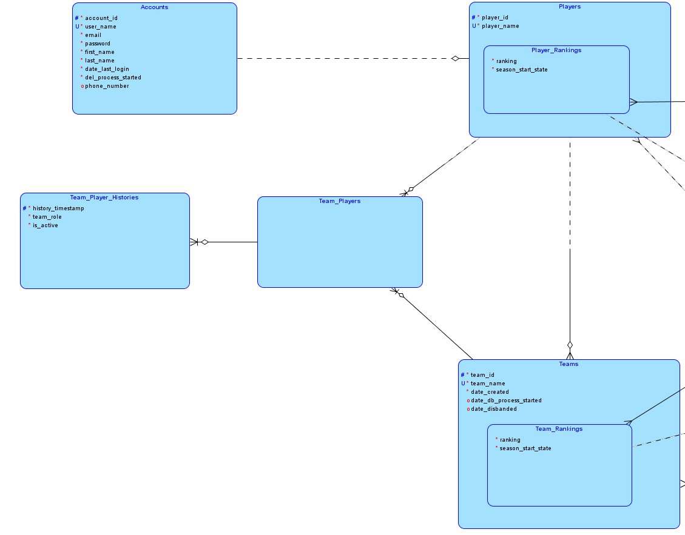
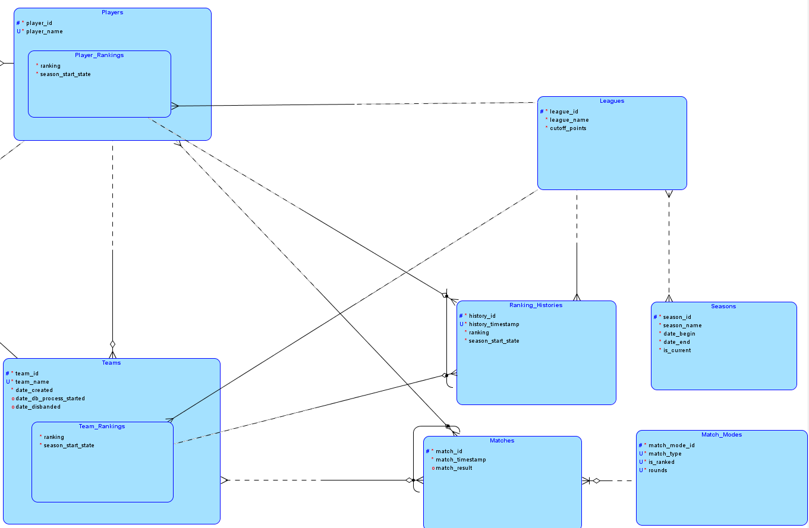
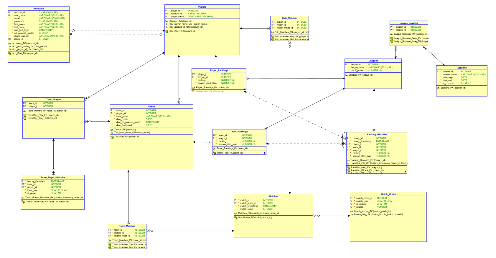

# League Ranking System

This is a simple league ranking system how it is commonly used in online videogames using PostgreSQL,
including an ERP model in Barker notation and a relational model that were built using Oracle SQL Developer Data Modeler.

There are a number of procedures that simplify the usage, as well as multiple triggers and constraints to ensure correctness.
For more information simply look through the soruce files [0_tables.sql](./src/0_tables.sql), [1_constraints.sql](./src/1_constraints.sql) and [2_logic.sql](./src/2_logic.sql) which are all meticulously commented.
There are also comments on all tables and even their individual columns which you could access inside PostgreSQL itself.

This project was developed as part of the course "Datenbanken IIA: Datenbank-Entwurf" 2021/2022.

# How is it set up?

Theres an accounts table which would typically be populated using the data from a website that
user would register through.
Every account can then create a player that is used for playing the game,
this way it would be possible to use the same account id for multiple different games.
Think of something like Blizzard or Steam, where you would have an account id that is unique to your account
but also an individual id for every game. Of course said game ids would then be only known inside
the individual game database.

Players can also be part of teams, take on different roles inside a team like team captain or
vice captain. There's also a team history that keeps track of changes inside a team,
including team members that set their status to inactive.

In general there's no instant account deletion or disbandment of a team,
instead one would start the process and after a set amount of time passed
the account should be deleted or team disbanded.



There's also a whole ranking system, including different leagues, seasons and promotions.
There are matches and match modes and of course a player ranking, team ranking and a ranking history.



The complete ERP model in Barker notation can be seen here:

")

The complete relational model can be seen here:



# How to run it?

Navigate to the source diretory and start psql:
```
cd src
psql -U postgres 
```

Simply install it using the install script:
```
\i install.sql
```

You can then test it, using the mockup data:
```
\i populate.sql
```

Afterwards simply reinstall it by running the update script:
```
\i update.sql
```

To remove it simply run:
```
\i uninstall.sql
```

# Contents

## pics

This directory contains the picture of the model created
using the Oracle SQL Developer Data Modeler.

## src

This directory contains the actual source code,
including some helper files to make the install,
uninstall, update and population process less tedious.

